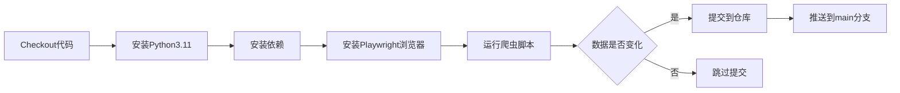

# Ollama Models Database

自动爬取并维护 [Ollama](https://ollama.com/search) 网站的模型数据库，并提供 GraphQL API 查询接口。

## 项目简介

本项目使用 Python + Playwright 定期爬取 Ollama 官网的模型列表，并将数据保存为结构化的 JSON 格式。通过 GitHub Actions 实现每天自动更新，确保数据的时效性。同时提供了基于 Apollo Server 的 GraphQL API，方便开发者查询和过滤模型数据。

## 数据结构

爬取的数据保存在 `data/models.json` 文件中，结构如下：

```json
{
  "last_updated": "2026-01-15T00:00:00Z",
  "total_pages": 10,
  "total_models": 200,
  "models": [
    {
      "name": "llama3.1",
      "description": "Llama 3.1 is a new state-of-the-art model from Meta available in 8B, 70B and 405B parameter sizes.",
      "capabilities": ["tools"],
      "sizes": ["8b", "70b", "405b"],
      "url": "https://ollama.com/library/llama3.1"
    }
  ]
}
```

### 字段说明

| 字段 | 类型 | 说明 |
|------|------|------|
| `last_updated` | string | 最后更新时间（ISO 8601 格式，UTC） |
| `total_pages` | number | 爬取的总页数 |
| `total_models` | number | 爬取的模型总数 |
| `models` | array | 模型列表 |
| `models[].name` | string | 模型名称 |
| `models[].description` | string | 模型描述 |
| `models[].capabilities` | array | 模型能力标签（如 tools, vision, embedding 等） |
| `models[].sizes` | array | 可用的参数规模（如 7b, 13b, 70b 等） |
| `models[].url` | string | 模型详情页 URL |

## 技术栈

### 数据爬取
- **Python 3.11** - 编程语言
- **Playwright** - 无头浏览器自动化
- **GitHub Actions** - CI/CD 自动化

### API 服务
- **Node.js** - 运行时环境
- **TypeScript** - 类型安全的 JavaScript
- **Apollo Server 4** - GraphQL 服务器
- **pnpm** - 包管理器

## 爬虫特性

- ✅ **分页爬取**：自动遍历所有分页（最多 20 页）
- ✅ **智能停止**：检测 "No models found" 自动停止
- ✅ **资源优化**：禁用图片和字体加载，提升速度 50-70%
- ✅ **错误处理**：完善的异常捕获和日志输出
- ✅ **延迟控制**：页面间 1.5 秒延迟，避免请求过快

## 快速开始

### GraphQL API 服务器

#### 环境要求

- Node.js 18+
- pnpm

#### 安装依赖

```bash
pnpm install
```

#### 启动服务器

```bash
# 开发模式（带热重载）
pnpm dev

# 生产模式
pnpm build
pnpm start
```

服务器将在 `http://localhost:4000` 启动，访问 `http://localhost:4000/` 可以使用 GraphQL Playground 进行交互式查询。

#### API 使用示例

查看 [API_EXAMPLES.md](API_EXAMPLES.md) 获取详细的查询示例。

**简单查询示例**：

```graphql
# 搜索包含 "qwen" 的模型
query {
  models(filter: { nameContains: "qwen" }) {
    totalModels
    models {
      name
      description
      capabilities
      sizes
    }
  }
}

# 按能力过滤
query {
  models(filter: { capabilities: ["tools", "vision"] }) {
    models {
      name
      capabilities
    }
  }
}
```

### 运行爬虫

#### 环境要求

- Python 3.11+
- pip

#### 安装依赖

```bash
cd crawler
pip install -r requirements.txt
playwright install chromium
```

#### 运行爬虫

```bash
cd crawler
python scraper.py
```

运行成功后，数据将保存到 `data/models.json`。

## GitHub Actions 自动化

### 触发方式

1. **定时触发**：每天 UTC 00:00（北京时间 08:00）自动运行
2. **手动触发**：
   - 进入 GitHub 仓库的 `Actions` 标签页
   - 选择 "Scrape Ollama Models" 工作流
   - 点击 `Run workflow` 按钮

### 工作流程



### 权限配置

GitHub Actions 需要 `contents: write` 权限以自动提交数据更新。此权限已在 `.github/workflows/scrape.yml` 中配置。

## 配置说明

可以在 `crawler/scraper.py` 中修改以下配置：

```python
BASE_URL = "https://ollama.com/search"  # 爬取的基础 URL
MAX_PAGES = 20                          # 最大爬取页数
PAGE_TIMEOUT = 10000                    # 页面加载超时（毫秒）
PAGE_DELAY = 1.5                        # 页面间延迟（秒）
```

## 项目结构

```
ollama-db/
├── .github/
│   └── workflows/
│       └── scrape.yml          # GitHub Actions 工作流配置
├── crawler/
│   ├── scraper.py              # 主爬虫脚本
│   ├── requirements.txt        # Python 依赖
│   └── .gitignore              # Git 忽略配置
├── data/
│   └── models.json             # 爬取的模型数据
├── src/                        # GraphQL API 源代码
│   ├── index.ts                # Apollo Server 入口
│   ├── schema.ts               # GraphQL Schema 定义
│   ├── resolvers.ts            # GraphQL Resolvers
│   ├── types.ts                # TypeScript 类型定义
│   └── data-loader.ts          # 数据加载器
├── dist/                       # 编译后的 JavaScript 代码
├── package.json                # Node.js 项目配置
├── tsconfig.json               # TypeScript 配置
├── .gitignore                  # 项目级 Git 忽略配置
├── LICENSE                     # MIT 许可证
├── README.md                   # 项目文档
└── API_EXAMPLES.md             # GraphQL API 使用示例
```

## 注意事项

1. **资源消耗**：Playwright 首次运行会下载 Chromium 浏览器（约 300MB）
2. **网站变化**：如果 Ollama 网站 DOM 结构发生变化，可能需要更新选择器
3. **GitHub Actions 配额**：
   - 公共仓库：无限分钟数
   - 私有仓库：2000 分钟/月
4. **数据更新**：只有当数据发生变化时才会创建新的 commit

## 常见问题

### 爬虫失败怎么办？

检查以下几点：
1. 网络连接是否正常
2. Ollama 网站是否可访问
3. 查看 Actions 日志中的错误信息
4. 检查网站 DOM 结构是否有变化

### 如何修改爬取频率？

修改 `.github/workflows/scrape.yml` 中的 cron 表达式：

```yaml
schedule:
  - cron: '0 0 * * *'  # 每天 00:00
  # - cron: '0 */6 * * *'  # 每 6 小时
  # - cron: '0 0 * * 0'    # 每周日
```

### 如何查看历史数据？

通过 Git 历史记录可以查看数据的变化：

```bash
# 查看提交历史
git log --oneline data/models.json

# 查看某次提交的数据
git show <commit-hash>:data/models.json
```

## 许可证

本项目采用 [MIT License](LICENSE) 开源协议。

## 贡献

欢迎提交 Issue 和 Pull Request！

---

**维护者**: [Lumenis（明识）](https://github.com/lumenis)
